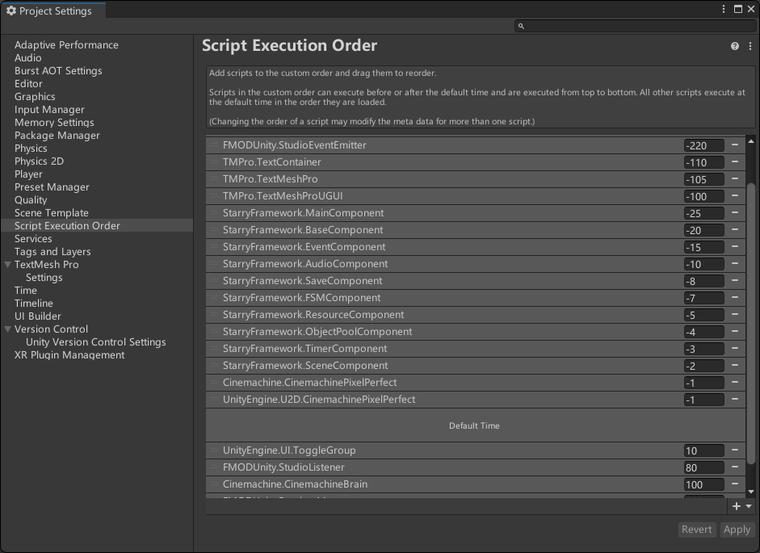
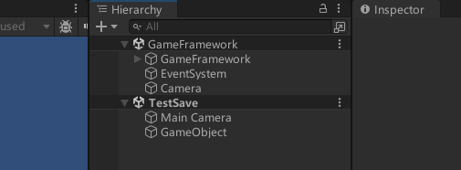

<p align="center"></p>

<p align="center">
	<a href="https://github.com/starryforest-ymxk/StarryFramework/blob/master/LICENSE.md"></a>
    <a href="https://github.com/starryforest-ymxk/StarryFramework/releases"></a>
</p>

|[中文](README.md)|[English](README_EN.md)|

[toc]

---

## About StarryFramework

StarryFramework is a lightweight Unity development framework offering a range of ready-to-use methods, such as events, game saving, fsm, object pool, timers, scene management, and more. It employs an MOM architecture to organize various modules, ensuring zero coupling between them. The framework encapsulates Unity's provided APIs, effectively speeding up development and ensuring game quality.

### Introduction to Basic Modules

In the current version, seven basic modules are included:

1. **Event Module**: Implemented based on delegates and managed using custom event constants. It provides methods for adding event listeners, removing event listeners, and triggering events. It supports events with up to four different parameters, allowing events with different parameters to have the same name.
2. **Save module**：Offers features like automatic saving, manual saving, save retrieval, save selection, save overwriting, and save creation and deletion. Each save can have annotated information. Save data is stored in JSON format, while game settings are stored using `PlayerPrefs`. Boolean fields declared in the save can be automatically set to true by triggering an event with the same name and no parameters (implemented via reflection).
3. **FSM Module**：Provides methods for managing multiple Fsms, supporting the registration, destruction, and parameter management of multiple Fsms.

4. **Object Pool Module**: Provides methods for managing multiple object pools, supporting the creation of GameObject type and regular type object pools, and automatic periodic release of expired objects.
5. **Timer Module**: Offers methods for managing ordinary timers, event-triggered timers, and async timers, supporting automatic management of multiple timers.
6. **Scene Module**: Encapsulates Unity's API, providing methods for loading, unloading, and switching scenes. It offers methods for switching scenes using default fade-in/fade-out animations and progress bar animations. You can inherit the `LoadProgressBase` class to implement custom progress bar animations. It supports multiple Unity asynchronous processes using a single progress bar to display the overall process.
7. **Resource Management Module**: Encapsulates Unity's API, providing methods for synchronous resource loading, asynchronous resource loading, and resource unloading.

For specific usage of the modules, refer to the code comments in `StarryFramework.XXComponent`.

You can also create custom modules based on your needs.

### Folder Structure

The `StarryFramework.unitypackage` you downloaded contains the following folder structure:

```
Plugins/
StarryFramework/
├── Attributes/
├── Framework/
│   ├── Editor/
│   ├── Runtime/
│   │   ├── Base/
│   │   ├── Static/
│   │   ├── Utilities/
│   │   └── XXModule/
├── Info/
└── Scene/
```

The contents of each folder are as follows:

- **Plugins :** 

  Contains third-party libraries required by the framework

- **StarryFramework**

  - **Attributes :** 

    Contains custom extended attributes, including features like collapsible sections and scene selection

  - **Framework**

    - **Editor :** 

      Custom inspector panels for each module, including module settings and runtime state displays

    - **Runtime**

      - **Base :** 

        Includes some basic base classes and fundamental nodes; this part can be used to implement custom modules

      - **Static :** 

        Static content of the framework, including enum type definitions and the **<u>framework entry class</u> `Framework`**

      - **Utilities :** 

        Provides some singleton base classes and simple utility functions

      - **XX Module :** 

        Various module codes

  - **Info :** 

    Contains readme and license files

  - **Scene :** 

    Provides a basic scene containing framework nodes, serving as the game's starting scene

### Extension Module

In the current version, one extension module is included:

- Audio Module

  Considering that some projects might use audio middleware to manage game audio in practical development, this framework provides an audio module tailored for Fmod. This audio module encapsulates the APIs provided by Fmod, making the interface more concise and easier to use.

  The audio module manages audio and BGM, supports volume control across multiple output channels, and allows dynamic attachment of audio to objects; it supports automatic playback of BGM specific to different scenes, audio preloading, etc.

  The content of the audio module is found in `StarryFramework_AudioExtention.unitypackage`.


## Download

- Download the unitypackage

  Visit the [release page](https://github.com/starryforest-ymxk/StarryFramework/releases) to download `StarryFramework.unitypackage`.

  If your project uses Fmod and you need the framework's extension for Fmod, also download `StarryFramework_AudioExtention.unitypackage`.

- Clone the repository

  You can also clone the project repository:

  ``` 
  git clone https://github.com/starryforest-ymxk/StarryFramework.git
  ```

  The repository uses Fmod to manage audio files, so it includes both the basic framework and extension content. Additionally, the `Assets/Test` directory contains some test code for various modules of the framework, which you might find interesting to check out.


## Quick Start

### Basic Setup

- Import the downloaded `StarryFramework.unitypackage` into your project. Open the scene `StarryFramework/Scene/GameFramework.unity` and add this scene to the **Scenes in Build** in the Build Settings. Ensure **buildindex of the  GameFramework scene is 0**. This scene will be used as the game's startup scene, serving as the entry point of the game, and will not be unloaded throughout the game.

- At this point, your Hierarchy window should look like this:

  

  In the GameFramework, the `MainComponent` script is attached, and each module node has the `XXComponent` script attached on it.

  In the GameFramework's Inspector window, you can adjust Unity's runtime settings and the framework's basic settings:

  

  In the framework settings, you need to set the start scene: If the start scene is GameFramework, then the game will do nothing on game start.

  The `Modules` list below, contains all the modules currently enabled in the framework. You can remove some modules that are not needed. However, please note that the **<u>Scene module should always be retained, and do not include two of the same modules in the list</u>**. The order of the modules represents their priority; modules closer to the front of the list have higher priority. Higher priority modules are initialized earlier and deregistered later, and are called earlier in each frame of the lifecycle.

  On the Inspector window of each submodule, you can also configure some properties for certain modules, such as Scene module, Timer module, and Save module.

- In the GameFramework scene, the camera is attached with the `SceneChangeCameraControl` script. This camera is used for rendering scene transition animations and is only enabled when transition animations need to be played. You can also check Is Main Camera to use it as the main camera, keeping it enabled throughout.

- If your project is sensitive to the order of script execution during the lifecycle, you can control the framework scripts to be called before the default time:

  

  Note: Set the call order of the `MainComponent` script to precede that of other `Component` scripts.

- <u>**Always start the game from the GameFramework scene when running.**</u> For example, if you want to run the TestSave scene, you must first select TestSave in the MainComponent:

  

  Ensure the Scene module is present:

  

  The Hierarchy window should retain the only GameFramework loaded scene (other unloaded scenes are also allowed): 

  

  Run the game, and the framework will automatically load the initial scene TestSave:

  

- **Calling Framework Provided Methods**: All methods provided by the framework modules are accessed via the static class `Framework`, using `Framework.XXComponent`. The `StarryFramework` namespace needs to be included. For example, a call to register an event could be written as:

  ``` c#
  Framework.EventComponent.AddEventListener<Object>("Event2", Event2);
  ```

  To understand the usage of the methods provided, you can refer to the script comments for each `XXComponent` script.

  Additionally, some utility methods are provided in the static class `Utilities`.

- **Save Module**: You can declare fields that need to be managed within the `GameSettings` and `PlayerData` classes included in the save module.

### Extension Part

- Building on the work mentioned above, import the FMOD Unity integration suitable for your project. Due to licensing restrictions, FMOD is not included in the distributed version.

  > **FMOD Studio**: Provided by Firelight Technologies Pty Ltd, used for audio management and integration. Due to licensing restrictions, FMOD is not included in the distributed version. Visit the [FMOD official website](https://www.fmod.com/) for more information.

  After importing FMOD, import the downloaded `StarryFramework_AudioExtention.unitypackage` into your project.

- Add the **Audio module** under Modules Enabled in the Main Component:

  

  Also, drag the Audio prefab from the Audio Module into the GameFramework scene as a child object: 

  

- Configure the settings of the Audio Component, such as the globally loaded audio banks and the BGM for each scene.

  

- In your code, simply call the provided methods using `Framework.AudioComponent`. For specific usage of these methods, refer to the comments in the AudioComponent code.


## License and Acknowledgements

StarryFramework is licensed under the [MIT License](https://github.com/starryforest-ymxk/StarryFramework/blob/master/LICENSE.md)

This project utilizes the following open-source libraries:

- FMOD Studio

  This project employs FMOD Studio and technology provided by Firelight Technologies Pty Ltd. Visit the [FMOD official website](https://www.fmod.com/) to obtain and integrate FMOD.

- Dotween (included in `StarryFramework.unitypackage`)

  This project uses DOTween, developed by Daniele Giardini - Demigiant, for animation management. For more information, see the [DOTween official website](http://dotween.demigiant.com/).

Additionally, thanks to my friend [NoSLoofah](https://github.com/NoSLoofah) for his assistance during the development of this framework.

## Support

- email：1911308683@qq.com，starryforest_ymxk@outlook.com

- If you find this framework useful, please consider leaving a star, much appreciated!
- If you have ideas, welcome your contributions!
