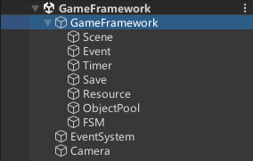
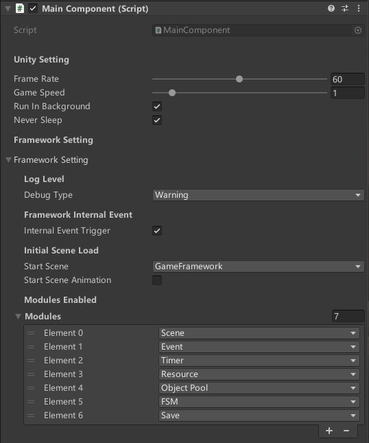
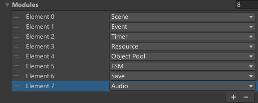
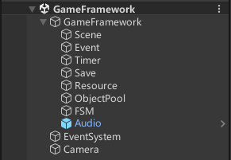
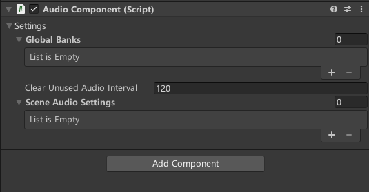

<p align="center"></p>

<p align="center">
	<a href="https://github.com/starryforest-ymxk/StarryFramework/master/LICENSE"></a>
    <a href="https://github.com/starryforest-ymxk/StarryFramework/releases"></a>
</p>

|[中文](/README.md)|[English](/README_EN.md)|

---

## 关于StarryFramework

StarryFramework 是一个轻量化的Unity开发框架，提供了一系列开箱即用的方法，例如事件、存档、有限状态机、对象池、计时器、场景管理等等。采取MOM架构组织各个模块，模块之间零耦合。框架对Unity提供的API进行了封装，可以有效加快开发速度，保证游戏质量。

### 基础模块简介

在目前提供的版本中，包含七个基础模块：

1. 事件模块：基于委托实现，依靠自定义事件常量进行管理。提供添加事件监听，删除事件监听，触发事件等方法；最多支持携带四个不同参数的事件，不同参数的事件允许同名。
2. 存档模块：提供自动存档，手动存档，存档检索，存档选择，存档覆盖，存档创建删除等功能；可以为每一个存档设置注释信息；存档信息采用Json格式储存，游戏设置信息采用`PlayerPrefs`储存。在存档中声明的布尔类型的字段，可以由触发同名无参数事件的方式自动设置为真（采用反射实现）。
3. 有限状态机模块：提供为多状态机管理的方法，支持多个状态机的注册，销毁，参数管理。

4. 对象池模块：提供为多对象池管理的方法，支持创建GameObject类型与普通类型对象池，支持自动定期释放过期对象；
5. 计时器模块：提供普通计时器，触发事件计时器，异步计时器的管理方法，支持多个计时器的自动托管；
6. 场景管理模块：对unity的api进行了封装，提供场景的加载，卸载，切换等方法；提供了使用切换来加载或者切换场景的方法，可以使用默认的淡入淡出动画以及进度条动画。你可以继承`LoadProgressBase`类来实现自定义的进度条动画。支持多个Unity异步进程使用一个进度条展示总过程。
7. 资源管理模块：对unity的api进行了封装，提供同步加载资源，异步加载资源，卸载资源等方法。

具体模块的用法可以见`StarryFramework.XXComponent`内的代码注释。

你也可以根据你的需求编写自定义的模块。

### 文件夹结构

你下载的`StarryFramework.unitypackage`包含以下文件夹结构：

```
Plugins/
StarryFramework/
├── Attributes/
├── Framework/
│   ├── Editor/
│   ├── Runtime/
│   │   ├── Base/
│   │   ├── Static/
│   │   ├── Utilities/
│   │   └── XXModule/
├── Info/
└── Scene/
```

各个文件夹包含的内容如下：

- Plugins : 包含框架需要引用的第三方库
- StarryFramework
  - Attributes : 包含自定义拓展的Attribute，包括折叠框与场景选择等功能
  - Framework
    - Editor : 为每一个模块编写的自定义编辑器面板，包括模块设置以及运行时的状态查看
    - Runtime
      - Base : 包括一些底层的基类，基础节点等；你可以使用这部分来实现自定义模块
      - Static : 框架静态内容，包括枚举类型定义，以及<u>**框架的入口类`Framework`**</u>
      - Utilities : 提供一些单例基类以及一些简单的工具函数
      - XX Module : 各种模块代码
  - Info : readme 和 license
  - Scene : 提供一个包含了框架节点的基础场景，是游戏的启动场景

### 扩展模块

在目前提供的版本中，包含一个扩展模块：

- 音频模块

  考虑到在实际开发中，部分项目会采取音频中间件的方法管理游戏音频，因此本框架提供了针对于Fmod的音频模块。这个音频模块对Fmod提供的API进行封装，使得接口更加简洁，易于使用。

  音频模块提供了音频，BGM的托管，支持多输出通道的音量控制，支持将音频动态附着到物体上；支持针对于不同场景的BGM自动播放，音频预加载等。

  音频模块的内容在`StarryFramework_AudioExtention.unitypackage`中。


## 框架下载

- 下载unitypackage包

  前往[发布页面](https://github.com/starryforest-ymxk/StarryFramework/releases)下载`StarryFramework.unitypackage`

  如果的项目使用fmod并且需要框架关于fmod的扩展的话，同时下载`StarryFramework_AudioExtention.unitypackage`

- 克隆项目仓库

  你也可以克隆项目仓库：

  ``` 
  git clone https://github.com/starryforest-ymxk/StarryFramework.git
  ```

  仓库中采用fmod管理音频文件，因此包含了基础框架和扩展内容。同时，仓库内的`Assets/Test`内还包含了一些对框架各模块的测试代码，如果你有兴趣也可以看看。


## 快速开始

### 基础部分

- 将下载的`StarryFramework.unitypackage`全部导入到项目中。打开`StarryFramework/Scene/GameFramework.unity`场景，将这个场景添加到Build Settings 的 Scenes in Build 里面。**确保 GameFramework 场景的buildIndex是0。**这个场景将用作游戏的启动场景，作为游戏入口点，且在游戏全程都不会卸载。

- 此时，你的Hierarchy窗口应该看起来像这样：

  

  其中，GameFramework挂载了`MainComponent`脚本，各个模块节点挂载了`XXComponent`脚本。

  在GameFramework的编辑器界面上，你可以对Unity的运行设置以及框架的基础设置进行调整：

  

  其中，框架设置中，你需要设置框架的启动场景Start Scene：如果启动场景是GameFramework，则游戏启动不会进行任何操作。

  下面的Modules列表包含了所有当前框架启用的模块。你可以从中删除一些不需要的模块。但是请注意，**<u>Scene模块请永远保留，而且不要在列表中包含两个相同的模块</u>**。模块之间的顺序代表了他们的优先级，越靠近列表前部的模块优先级越高。优先级越高的模块会更早地初始化，更晚地注销，在生命周期中每帧更早地调用。

  在每个子模块对应的编辑器面板上，你也可以为某些模块配置一些属性，如Scene模块，Timer模块，Save模块。

- 在 GameFramework 场景中的摄像机挂载了`SceneChangeCameraControl`脚本，这个相机用作场景切换动画的渲染，这个相机只会在需要播放切换动画的时候启用。你也可以勾选 Is Main Camera 将其作为主相机，在全程都启用。

- 如果你的项目对某些脚本在生命周期的运行顺序敏感，那么你可以控制框架脚本在默认时间之前调用：

  

  注意：将MainComponent的调用顺序设置先于其它Component的脚本

- <u>**在游戏运行的时候，一定要从GameFramework场景启动。**</u>例如，当你想要运行场景TestSave的时候，一定要先在MainComponent中选择TestSave ：

  

  确保Scene模块存在：

  

  Hierarchy窗口保留唯一的GameFramework场景处于已加载状态（也可以有其它处于unload状态的场景）：

  

  运行游戏，框架自动加载初始场景TestSave ：

  

- 调用框架提供的方法。所有框架模块提供的方法都使用Framework这个静态类作为入口，使用`Framework.XXComponent`的方式调用。需要引用StarryFramework命名空间。例如，一个注册事件的调用可以这么写：

  ``` c#
  Framework.EventComponent.AddEventListener<Object>("Event2", Event2);
  ```

  具体提供方法的用法可以查看每个`XXComponent`的脚本注释。

  除此之外，还提供了一些工具方法，在静态类`Utilities`中。

- 存档模块：你可以在存档模块中包含的`GameSettings`类和`PlayerData`类中声明需要管理的属性。

### 扩展部分

- 在上述工作的基础上，导入适合你项目的fmod unity集成。由于许可限制，FMOD不包含在分发版本中。

  > **FMOD Studio**：由Firelight Technologies Pty Ltd提供，用于音频管理和集成。由于许可限制，FMOD不包含在分发版本中。访问[FMOD官网](https://www.fmod.com/)获取更多信息。

  在导入fmod之后将下载好的`StarryFramework_AudioExtention.unitypackage`导入到项目中

- 在Main Component的Modules Enabled下面加入Audio模块：

  

  同时将Audio Module中的Audio预制体拖入到场景GameFramework物体下面，作为子物体：

  

- 配置Audio Component的设置，如全局加载的音频库，每个场景的BGM等等。

  

- 在代码中使用`Framework.AudioComponent`的方式调用提供的方法即可。具体方法用法见AudioComponent代码注释。


## 版权声明与致谢

StarryFramework采用[MIT协议](https://github.com/starryforest-ymxk/StarryFramework/master/LICENSE)

本项目使用了以下开源项目库：

- FMOD Studio

  本项目使用了FMOD Studio和Firelight Technologies Pty Ltd提供的技术。访问[FMOD官网](https://www.fmod.com/)获取并集成FMOD

- Dotween（包含在`StarryFramework.unitypackage`中）

  本项目使用了DOTween，由Daniele Giardini - Demigiant开发，用于动画管理。详见 [DOTween官网](http://dotween.demigiant.com/)

同时，感谢我的好友[NoSLoofah](https://github.com/NoSLoofah)在我编写框架时提供的帮助。

## 支持

- 邮箱：1911308683@qq.com，starryforest_ymxk@outlook.com

- 如果觉得有用的话，可以留一个star，万分感谢
- 如果你有想法的话，欢迎贡献代码！

